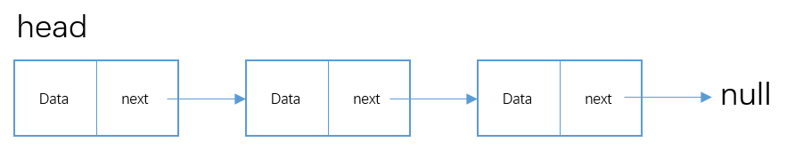

## 链表

[TOC]


### 1. 单向链表

#### 1.1 数据结构

##### 1.1.1 节点结构

每个节点中除了存储 `data` 之外还存储着下一个节点的引用 `next`。

#### 

##### 1.1.2  链表结构

对于空链表头指针为 `null` , 对于任意的非空链表， 如果节点 `A` 有后继节点 `B` ， 则 `A.next = B` 且 `A` 只能有 `B` 一个后继节点， 链表的最后一个节点 `C` 没有后继节点， 所以 `C.next = null`  。



#### 1.2 代码实现

##### 1.2.1 接口

```java
package com.juck.list.listinterface;

public interface List<E> {
    int size(); // 返回链表中元素的个数

    boolean isEmpty(); // 判断链表是否为空

    boolean add(E e); // 向链表末端添加元素

    E remove(E e); // 移除元素

    boolean contains(E e); // 链表中是否有此元素

    void print(); // 从头至尾输出此链表
}
```

##### 1.2.2 实现类

``` java
public class SinglyLinkedList<E> implements List<E> {
    private Node<E> head;
    private int size;
    
    public int size() {
        return size;
    }

    boolean isEmpty() {
        return size == 0;
    }

    boolean add(E e);

    E remove(E e);

    boolean contains(E e);

    void print();
    
    private static class Node<E> {
        private E item;
        private Node<E> next;
        
        public Node(E item, Node<E> next) {
            this.item = item;
            this.next = next;
        }
    }
}
```


##### 1.2.3 方法实现

1.2.3.1 `add` 方法实现

```java
@Override
public boolean add(E e) {
    Node<E> newNode = new Node<>(e, null); // 在链表末端添加，所以添加元素的下一个一定是null.

    if (Objects.isNull(head)) { // 如果头节点为null, 则将新加的节点设置为头节点
        head = newNode;
        size++;
        return true;
    }

    Node<E> current = head; // 如果头节点不为空, 则遍历链表找到最后一个节点, 这里一定不能用head, 要保证头节点不能移动
    while(Objects.nonNull(current.next)) {
        current = current.next;
    }
    size++;
    current.next = newNode;
    return true;
}
```

1.2.3.2 `remove` 方法实现

``` java
@Override
public E remove(E e) {
    E value = null;
    if (size == 0 || Objects.isNull(head)) { // 边界判断
        return value;
    }

    if (Objects.equals(head.item, e)) { // 删除头节点
        value = head.item;
        head = head.next;
        return value;
    }

    Node<E> current = head;
    while(Objects.nonNull(current.next)) { // 删除中间节点， 遍历链表找到要删除的节点
        if (Objects.equals(current.next.item, e)) {
            value = current.next.item;
            current.next = current.next.next;
            return value;
        }

        current = current.next;
    }

    return value;
}
```

##### 1.2.3.3 `print` 方法实现

```java
@Override
public void print() {
    Node<E> current = head;
    while (Objects.nonNull(current)) {
        System.err.printf("%d -> ", current.item);
        current = current.next;
    }
    System.err.println("NULL");
}
```

1.2.3.4 `contains` 方法

此方法和 `remove` 大同小异， 不放这里了， 占地方。


