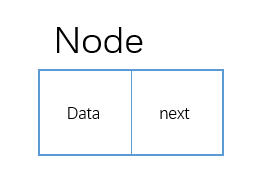
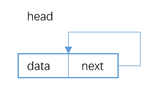
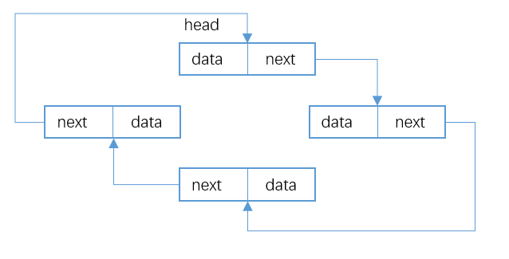
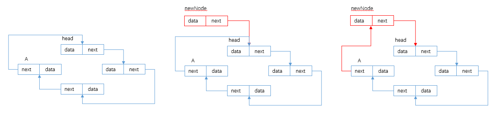
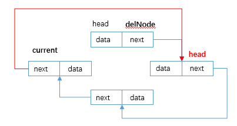
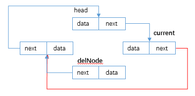
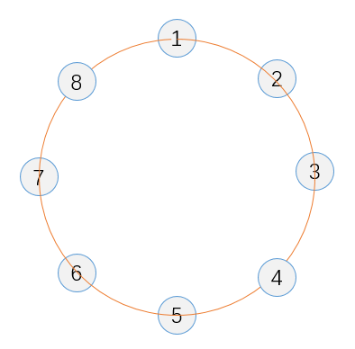

# 单向循环链表

[TOC]

## 1 数据结构

### 1.1 节点结构

&emsp;&emsp;每个节点中除了存储 `data` 之外还存储着下一个节点的引用 `next`。



### 1.2  链表结构

* 空链表: 头节点为 `null` , `head = null` 。

* 只有一个节点:  `head != null && head.next = head` 。

  

* 有N个节点: 每个节点的 `next` 都指向下一个节点， 最后一个节点的 `next` 指向头节点。




## 2. 代码实现

### 2.1 接口

```java
public interface List<E> {
    int size();

    boolean isEmpty();

    boolean add(E e);

    E remove(E e);

    boolean contains(E e);

    void print();
}
```

### 2.2 实现类

```java
public class singlyCircularLinkedList<E> implements List<E> {
    private Node<E> head;
    private int size;
    
    @Override
    public int size() {
        return size;
    }

    @Override
    public boolean isEmpty() {
        return size == 0;
    }

    @Override
    public boolean add(E e) {}

    @Override
    public E remove(E e) {}

    @Override
    public boolean contains(E e) {}

    @Override
    public void print() {}
    
    private void checkBoud() {
        if (size == 0 || Objects.isNull(head)) {
            throw new IndexOutOfBoundsException();
        }
    }
    
    private static class Node<E> {
        private E item;
        private Node<E> next;

        public Node(E item, Node<E> next) {
            this.item = item;
            this.next = next;
        }
    }
}
```

### 2.3 方法实现

#### 2.3.1 `add` 方法

&emsp;&emsp;对于要添加的数据， 构造一个 `newNode` 且 `newNode.next = head` 有以下情况:

* 链表为空, 将 `newNode` 作为头节点。

* 链表不为空， 如下图， 找到最后一个节点 `A` 将`A.next` 指向待插入的 `newNode` 。

  

```java
@Override
public boolean add(E e) {
    Node<E> newNode = new Node<>(e, head); // 在链表末端添加， 所以next一定指向head。

    if (Objects.isNull(head)) { // 创建头节点。
        head = newNode;
        head.next = head;
        size++;
        return true;
    }

    /**
     * 遍历链表找到最后一个节点， 
     * 因为是环形的，所以如果我的下一个是头节点，那么我就是最后一个节点了  
     */
    Node<E> current = head;
    while (!Objects.equals(current.next, head)) {
        current = current.next;
    }

    size++;
    current.next = newNode;

    return true;
}
```

#### 2.3.2 `remove` 方法

&emsp;&emsp;对于删除其实没有特殊节点， 但是也分一下删除头节点和中间节点。

* 链表只有一个头节点 `head`： `head = null` 完成删除。

* 链表有N个节点，删除头节点：遍历链表， 找到 `current.next == head` ,将 `current.next = head.next` 即完成删除头节点， **然后记得移动头节点 `head = head.next`** 。如果不移动的话， `head` 依然在链表中。

  

* 链表有N个节点， 删除中间节点： 遍历链表， 找到 `current.next == delNode` ,将 `current.next = delNode.next` 即完成删除头节点

  

  ```java
  @Override
  public E remove(E e) {
      E value = null;
      checkBoud();
  
      if (Objects.equals(head.item, e)) { // 删除头节点
          value = head.item;
  
          if (Objects.equals(head, head.next)) { // 链表只有一个头节点
              head = null;
              size--;
              return value;
          }
  
          Node<E> current = head;
          while (!Objects.equals(current.next, head)) { // 链表有N个节点
              current = current.next;
          }
  
          current.next = head.next;
          head = head.next;
  
          size--;
          return value;
      }
  
      Node<E> current = head;
      while (!Objects.equals(current.next, head)) { // 删除中间节点
          if (Objects.equals(current.next.item, e)) {
              value = current.next.item;
              current.next = current.next.next;
              size--;
  
              return value;
          }
          current = current.next;
      }
  
      return value;
  }
  ```

#### 2.3.3 contain  方法

* 先判断头节点是不是要查找的节点， 是则返回， 否则进行下一步

* 构造 current 节点并判断 current.next 是不是要查找的节点， 是则返回， 否则进行下一步

* `current = current.next` `current` 节点移动直至找到节点或者遍历完节点 `current.next == head` 

  ```java
  @Override
  public boolean contains(E e) {
      if (size == 0 || Objects.isNull(head)) {
          return false;
      }
  
      if (Objects.equals(head.item, e)) {
          return true;
      }
  
      Node<E> current = head;
      while (!Objects.equals(current.next, head)) {
          if (Objects.equals(current.next.item, e)) {
              return true;
          }
          current = current.next;
      }
  
      return false;
  }
  ```

## 3. `Josephus` 问题

  &emsp;  Josephus和他的朋友以及一群犹太人玩的一个自杀游戏(真实情况自行搜索)， 41个人组成一个环形， 从第一个人开始报数， 数到3的这个人自杀， 然后从后面这个人开始报数， 数到3的人自杀， 一直这样循环直到所有人都死完了。

&emsp;&emsp;但是Josephus和他的朋友并不想死， 然后Josephus经过一顿操作，告诉了他的朋友应该怎么风骚的站位才能留到最后只剩下他和Josephus， 这样他们两个就活下来了。

&emsp;&emsp;问这个风骚的站位是怎么站的? 

### 3.1 分析



&emsp;&emsp;假设有8个人如上图站位 `1 -> 2 -> 3-> 4 -> 5 -> 6 -> 7 ->8 -> 1`, 我们模拟一下游戏: 

| 轮数 | 自杀人 | 剩余人                               |
| ---- | ------ | ------------------------------------ |
| 1    | 3      | 1 -> 2 -> 4 -> 5 -> 6 -> 7 -> 8 -> 1 |
| 2    | 6      | 1 -> 2 -> 4 -> 5 -> 7 -> 8 -> 1      |
| 3    | 1      | 2 -> 4 -> 5 -> 7 -> 8 -> 2           |
| 4    | 5      | 2 -> 4 -> 7 -> 8 -> 2                |
| 5    | 2      | 4 -> 7 -> 8 -> 4                     |
| 6    | 8      | 4 -> 7                               |

&emsp;&emsp;游戏模拟完后很容易得出解题思路， 将参与游戏的人组成一个环形链表， 每次将要自杀的人踢出链表， 直到只剩下两人。

### 3.2 代码实现

```java
/**
 *
 * @param total 参与游戏的总人数
 * @param start 从第几个人开始
 * @param rate 数几个开始自杀
 * @param liveNum 最终要存活几个
 */
public void nJosephus(int total, int start, int rate, int liveNum) {
    if (total < rate) {
        throw new RuntimeException("total must be bigger than rate!");
    }

    Node<Integer> root = new Node<>(1, null);
    root.next = root;
    for (int i = 1; i < total; i++) { // 添加total个参与游戏的人
        Node<Integer> newNode = new Node<>(i + 1, root);
        Node<Integer> current = root;
        while (!Objects.equals(current.next, root)) {
            current = current.next;
        }
        current.next = newNode;
    }

    Node<Integer> first = root; // 报数的人， 每次报数往后移动一位
    Node<Integer> current = first; // 永远指向报数的人的前一个， 因为正在报数的人是即将要自杀的人
    while (current.next != root) {
        current = current.next;
    }
    for (int i = 1; i < start; i++) { // 将报数的人移动到开始位置
        first = first.next;
        current = current.next;
    }

    while (total != liveNum) {
        for (int i = 1; i < rate; i++) { // 报数
            first = first.next;
            current = current.next;
        }

        current.next = first.next; // 报数结束后 first 就是要自杀的那个人
        System.err.printf("%d -> ", first.item);
        first = first.next;
        total--;
    }
    System.err.println();

    Node<Integer> newCurrent = current;
    while (newCurrent.next != current) {
        System.err.printf("%d->", newCurrent.item);
        newCurrent = newCurrent.next;
    }
    System.err.printf("%d", newCurrent.item);
}
```


  


