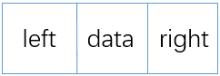
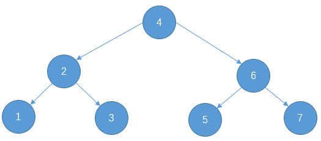
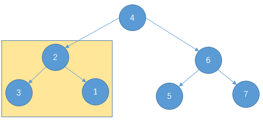
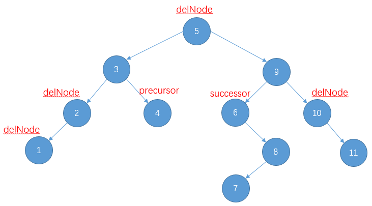

# 二叉排序树

[TOC]

## 1 数据结构

### 1.1 节点结构

&emsp;&emsp;每个节点除了存储数据外， 还会有两个引用， 分别指向以自身节点为根节点的左孩子和右孩子。



### 1.2 二叉排序树结构

&emsp;&emsp;一颗二叉排序树要么为空树， 要么就要满足以下条件:

1.   若左子树不空，则左子树上所有结点的值均小于它的根结点的值;
2.  若右子树不空，则右子树上所有结点的值均大于它的根结点的值;
3.  左、右子树也分别为二叉排序树;

&emsp;&emsp;因为以上条件的限制， 所以**二叉排序树使用中序遍历得到的一定是递增的有序序列**。记住这句话。

|                    正解                    |                  错误                  |
| :----------------------------------------: | :------------------------------------: |
|  |  |

## 2 代码实现

### 2.1 接口

&emsp;&emsp;因为二叉排序树的节点是有大小关系的， 所以泛型需要实现 `Comparable` 实现可比较。

```java
public interface ITree<E extends Comparable<E>> {
    boolean add(E e);

    E remove(E e);

    boolean search(E e);
}
```

### 2.2 实现类

```java
public class BSTree<E extends Comparable<E>> implements ITree<E> {
    private Node<E> root;
    
    @Override
    public boolean add(E e) {
        root = doAdd(root, e);
        return true;
    }
    
    private Node<E> doAdd(Node<E> target, E e) {}

    @Override
    public E remove(E e) {
        if (search(e)) {
            return false;
        }

        root = doRemove(root, e); // delete node recursively

        return true;
    }
    
    private Node<E> doRemove(Node<E> current, E e) {
        if (current.item.equals(e)) { // node to be deleted
            return doDelete(current);
        }

        /**
         * delete node recursively
         */
        if (current.item.compareTo(e) > 0) { // target node is on the left
            current.left = doRemove(current.left, e);
        } else { // target node is on the right
            current.right = doRemove(current.right, e);
        }

        return current;
    }
    
    private Node<E> doDelete(Node<E> current) {}

    @Override
    public boolean search(E e) {
        return Objects.isNull(doSearch(root, e));
    }
    
    private static class Node<E extends Comparable<E>> {
        E item;
        Node<E> left;
        Node<E> right;

        public Node(E item) {
            this.item = item;
        }
    }
}
```

### 2.3 方法实现

#### 2.3.1 doAdd

&emsp;&emsp;本文使用递归来实现添加节点， 传入目标节点 `target` (新节点将会被插入到这个位置)， 只要目标节点不为空， 则对待插入的节点和目标节点比较， 如果， 目标节点大， 表示待插入节点应该在放在目标节点左子树， 否则就是放在目标节点的右子树。

```java 
private Node<E> doAdd(Node<E> target, E e) {
    Node<E> newNode = new Node<>(e);
    if (Objects.isNull(target)) { // insert new element here
        return newNode;
    }

    /**
     * insert node recursively
     */
    if (target.item.compareTo(e) > 0) {
        target.left = doAdd(target.left, e);
    } else {
        target.right = doAdd(target.right, e);
    }

    return target;
}
```

#### 2.3.2 doSearch

&emsp;&emsp;查找很容易实现， 因为二叉排序树满足 `右子树节点的值 > 根节点的值 > 左子树节点的值` ， 只需要将待查找的值和根节点相比较。

* 如果相等， 则表示找到返回。

* 如果小于根节点的值， 表示在根节点的左子树， 向左递归查找。
* 如果大于根节点的值， 表示在根节点的右子树， 向右递归查找。
* 以上情况都不是则表示树中无此元素。

```java
private Node<E> doSearch(Node<E> target, E e) {
    if (Objects.isNull(target)) {
        return null;
    }

    if (target.item.compareTo(e) > 0) {
        return doSearch(target.left, e);
    }

    if (target.item.compareTo(e) < 0) {
        return doSearch(target.right, e);
    }

    return target;
}
```

#### 2.3.3 doDelete



&emsp;&emsp;删除节点分为以下几种情况：

* 删除节点是叶子节点或者只有左子树， 如上图中: 1, 4, 7, 11(叶子节点),; 2, 8(只有左子树)。这类节点删除只需要将此节点的右子树替换自身就可以。 `delNode = delNode.right` 。
* 删除节点是叶子节点或者只有右子树， 如上图中: 1, 4, 7, 11(叶子节点); 6, 10(只有右子树)。 这类节点删除只城要将此节点的左子树替换自身就可以。 `delNode = delNode.left` 。
* 删除节点同时有左子树和右子树， 如上图的3, 5, 9。这类节点删除可以用将它的前驱节点或者后继节点的值来覆盖自身的值， 然后删除这个前驱或者后继节点。本文使用后继节点（因为二叉排序树中序遍历是递增的， 所以此节点的后继节点就是此节点右子树的最左下角的节点）。

```java
private Node<E> doDelete(Node<E> current) {
    /**
     * node to be deleted only has left sub-tree or is leaf node
     */
    if (current.right == null) {
        return current.left;
    }

    /**
     * node to be deleted only has right sub-tree or is leaf node
     */
    if (current.left == null) {
        return current.right;
    }

    /**
     * node to be deleted(delNode) has both left and right sub-tree,
     * find successor node and copy content to delNode,
     * then, delete successor from delNode's right sub-tree recursively.
     */
    Node<E> successor = findSuccessor(current); // find successor node
    // copy content
    current.item = successor.item; 
    // delete successor node from right sub-tree recursively
    current.right = doRemove(current.right, successor.item); 

    return current;
}

private Node<E> findSuccessor(Node<E> root) {
    root = root.right;
    while (Objects.nonNull(root.left)) {
        root = root.left;
    }

    return root;
}
```


